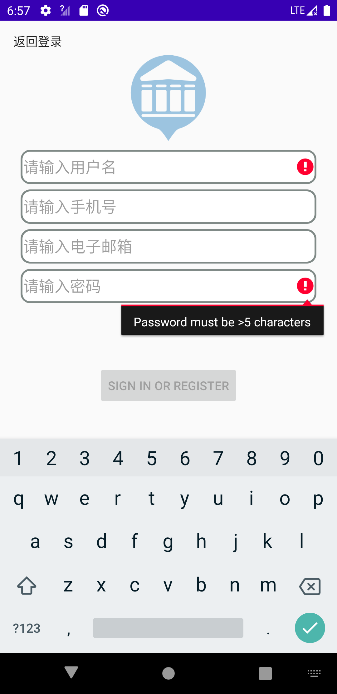
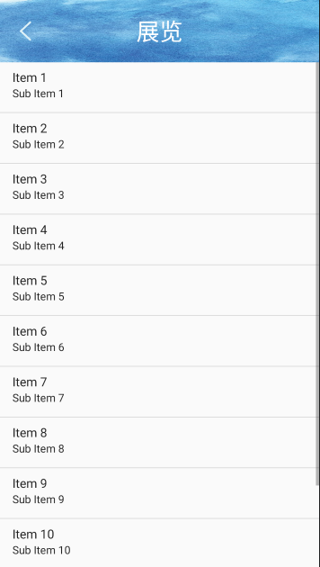

# 测试报告

## Schedule

|   Date    |    Description     | Recorder |
| :-------: | :----------------: | :------: |
| 2021.5.9  |    注册登录测试    |  于珊珊  |
| 2021.5.12 | 博物馆信息浏览测试 |  于珊珊  |
| 2021.5.14 |    地图浏览测试    |  于珊珊  |
| 2021.5.16 | 播放、上传讲解测试 |  于珊珊  |

## 1 简介

### 1.1 目的

本文档是博物馆导览子系统测试的记录和总结报告，目的在于记录、总结测试阶段的测试以及分析测试结果，描述系统是否符合需求。主要内容包括：

- 系统环境简介
- 测试执行情况
- 系统结果评估

本文档的预期读者是：

- 项目管理人员
- 开发人员
- 测试人员

### 1.2 范围

该文档总结了测试客户端关于用户个人信息管理、博物馆信息浏览、地图浏览和播放、上传讲解的基本功能，包括用例操作和界面显示，给出了测试的结论。

### 1.3 术语和缩写说明

| 术语和缩写 |                             说明                             |
| :--------: | :----------------------------------------------------------: |
|  测试用例  |       测试人员设计出来的用来测试软件某个功能的一种情形       |
|  缺陷分析  | 软件中存在的某种破坏正常运行能力的问题、错误，或者隐藏的功能缺陷 |

### 1.4 参考资料

《软件工程 实践者的研究方法》 Roger S.Pressman , Bruce R.Maxim ，机械工业出版社

## 2 测试描述

### 2.1 测试方法

我们使用的是面向对象测试类型中的交互测试，运用基于用例的交互测试。交互测试将代码类进行联合测试，以确定它们是否能够一起共同工作。 

### 2.2 测试环境

测试机器的配置环境如下：

- 数据库服务器配置：182.92.221.222
- 操作系统：CentOS 7/Win10
- 数据库：Mysql 8.0
- App：安卓8以上

### 2.3 详细描述

测试的时间、地点、设备和人员总结如下：

- 测试时间：2021-5-9至2021-5-16，基本按照计划进行
- 测试地点：主教学楼、学生宿舍
- 测试设备：个人笔记本电脑
- 测试人员：全体组员

## 3 测试执行情况

### 3.1 用户个人信息管理

#### 3.1.1 注册合法性验证

| 输入等价类 | 测试用例                              | 测试数据                      | 期望结果                       |  实际结果  |
| :--------: | :------------------------------------ | :---------------------------- | :----------------------------- | :--------: |
| 无效等价类 | 用户名：空 密码：5-16位（含）    | 用户名： 密码：12345     | 用户名为空，注册不成功         | 注册不成功 |
| 无效等价类 | 用户名：非空 密码：<5位 或 >16位 | 用户名：新用户 密码：123 | 密码长度不符合要求，注册不成功 | 注册不成功 |
| 有效等价类 | 用户名：非空 密码：5-16位（含）  | 用户名：123 密码：12345  | 注册成功                       |  注册成功  |

==测试结果==：能够验证用户名和密码的合法性。

==效果图==：

 

#### 3.1.2 注册查重验证

|        测试用例        | 测试结果 |
| :--------------------: | :------: |
| 用户名与已有用户名重复 | 注册失败 |
| 手机号与已有手机号重复 | 注册失败 |
|   邮箱与已有邮箱重复   | 注册失败 |

==测试结果==：能够验证用户名、手机号和邮箱的正确性，至此，系统的注册功能成功实现。

#### 3.1.3 登录

==测试结果==：输入正确的用户名和密码则能够成功登录到系统当中，输入错误则会提示重新输入。

### 3.2 博物馆信息浏览

#### 3.2.1 博物馆信息

测试用例：中国地质博物馆

==测试结果==：打开某个博物馆的页面，在网络情况正常的情况下能够正常显示博物馆所有信息。

==效果图==：

#### 3.2.2 展览信息

测试用例：中国国家博物馆——“生趣盎然——王雪涛艺术展”

==测试结果==：点击某个展览，在网络情况正常的情况下能够正常显示展览的详细信息。

==效果图==：

#### 3.2.2 藏品信息

测试用例：中国航空博物馆——“毛泽东的座机”

==测试结果==：点击某个藏品，在网络情况正常的情况下能够正常显示藏品的详细信息。

==效果图==：

### 3.3 地图浏览

测试用例：首都博物馆

==测试结果==：从博物馆页面点击定位图标，即可跳转到地图页面，并标记显示博物馆地理位置，同时可以在地图上显示当前用户定位。

==缺陷分析==：没有实现在地图上直接显示一个城市所有博物馆的功能，不能计算显示距离用户定位最近的博物馆。

==效果图==：

### 3.4 播放、提交讲解

==测试结果==：在某个博物馆的展览或藏品详情页面点击播放按钮，即可播放相关讲解；同时用户可以上传关于博物馆展览或藏品的文字讲解，平台审核通过后，可以在手机应用中查看该讲解。

==缺陷分析==：用户可以上传关于博物馆展览和藏品的文字讲解，但不能上传音频讲解。

==效果图==：

## 4 测试评估与总结

本次测试执行准备充足，完成了既定目标。但从测试结果来看，测试对象仍存在较多的缺陷，需要继续完善。
