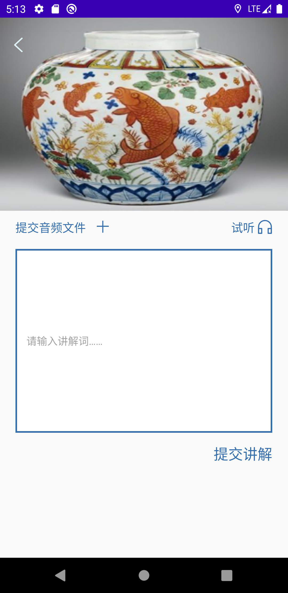

# 博物馆应用平台系统-导览子系统用户使用手册

## 1. 导言

### 1.1 目的

该文档的目的是描述博物馆应用平台系统-导览子系统的用户使用说明，其主要内容包括：

+ 运行环境
+ 安装与配置
+ 操作说明

本文档的预期读者是：

+ 用户
### 1.2 范围

该文档定义了系统提交产品的使用说明，主要描述了产品的操作流程，以及配置说明。

## 2. 概述

博物馆应用平台系统导览子系统是在线浏览系统，前端由安卓应用组成，后端运行在Tomcat服务器上，数据库系统为MySQL。此系统仅由客户端组成，客户端提供注册登录、定位博物馆位置、查看展览和展品的详细信息以及提交和播放其讲解等功能。客户端由安装包进行安装与配置。

提交产品包括：

+ 安卓客户端安装包
+ 用户使用手册

## 3. 运行环境

客户端环境要求：

+ 安卓版本：8.0及以上
+ CPU：2核及以上
+ 内存：2g及以上

## 4. 安装与配置

1. 下载apk安装包
2. 打开安装包进行安装
3. 安装完成

## 5. 操作说明

### 5.1 注册

在四个文本框中分别输入用户名、手机号码、邮箱和密码并点击注册即可完成注册并自动登录。

### 5.2 博物馆信息浏览（第三组）

### 5.3 博物馆位置定位

进入博物馆信息浏览页面之后（5.2），单击博物馆地点旁边的定位图标可以进入博物馆地图定位页面。

### 5.4 博物馆展览浏览（第三组）

博物馆展览页面以列表形式罗列出该博物馆的展览信息，用户可以上下拖动进行预览，点击后可以跳转到展览详细介绍页面。

### 5.5 展览详细介绍

### 5.6 博物馆藏品浏览（第三组）

博物馆藏品页面以列表形式罗列出该博物馆的藏品信息，用户可以上下拖动进行预览，点击后可以跳转到藏品详细介绍页面。

### 5.7 藏品详细介绍

### 5.8 讲解播放

通过点击展览、展品详细介绍页面的耳机图标，跳转至相应的讲解播放列表，单击耳机图标，待缓存完毕之后即可自动播放讲解。

### 5.9 讲解提交

通过点击展览、展品详细介绍页面的十字加号图标，跳转至讲解提交页面。选择相应的音频文件之后填写相应的文字讲解，单击提交，即可完成提交。

## 技术支持信息

本小组提供系统的维护与升级，在使用过程中如遇任何问题，可以及时与小组成员联络。具体联系方式如下：

邮箱：2018040488@mail.buct.edu.cn