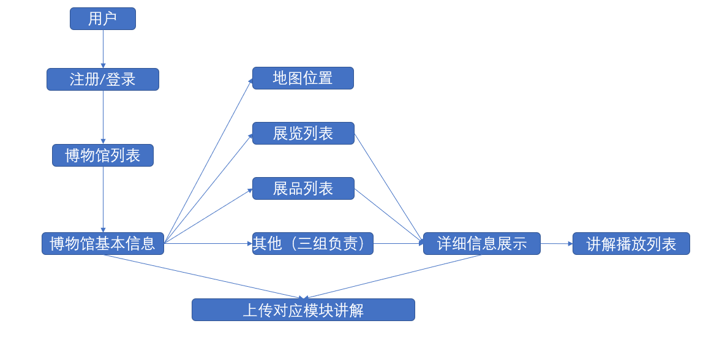
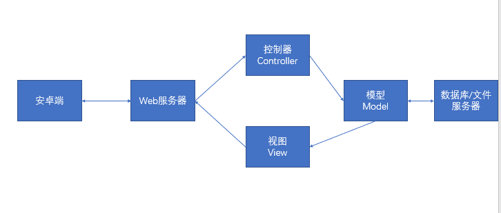
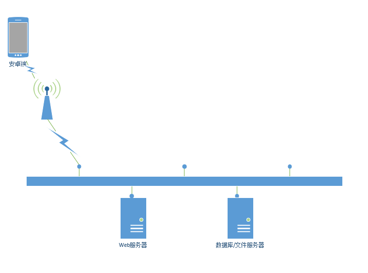

# 设计报告 ver1.0

## Revision

|Date|Version|Description|Author|
|:--:|:--:|:--:|:--:|
|2021.6.11|1.0|设计报告初稿|韩明宸|

## 1 导言

### 1.1 目的

该文档的目的是描述博物馆导览子系统的概要设计，其主要内容包括：
+ 系统功能简介
+ 系统结构设计
+ 系统借口设计
+ 数据设计
+ 模块设计
+ 界面设计

本文档的预期的读者是：
+ 开发人员
+ 项目管理人员
+ 测试人员

### 1.2 范围

该文档包括博物馆导览子系统的概要设计和详细设计两大部分，概要设计部分主要描述产品的模块划分、相互依赖关系和交互接口。详细设计部分主要描述概要设计部分关键功能的具体实现方法。

### 1.3 参考文献

课程教材 《软件工程 实践者的研究方法》 Roger S.Pressman , Bruce R.Maxim ，机械工业出版社 

## 2 系统分析

本子系统可以实现一个博物馆app的部分功能。包括以下内容。

+ 地图浏览：
    - 在地图上标注每个城市的博物馆，可以根据定位显示距离最近的博物馆。针对博物馆，在地图上标注该博物馆的近期展览和博物馆相关讲解。从地图可进入博物馆信息浏览、讲解等。
+ 博物馆信息浏览：
    - 显示博物馆的基本信息、展览信息、藏品信息等。
+ 播放讲解：
    - 播放一个博物馆、展览、藏品的相关讲解。
+ 自制讲解：
    - 用户可以录制并上传关于博物馆、展览和藏品的讲解，并上传到平台，平台审核通过后，可以在手机应用中播放该讲解。
+ 用户个人信息管理：
    - 用户可以注册登录该系统，设置用户名密码等个人信息。

app端功能如下图所示：

## 3 界面设计

本子系统的用户界面不完全，最终将会由团长负责整合。

+ 登录界面
    - 通过用户名和密码实现用户登录，没有账户的用户可以通过“注册”进入注册页面。

+ 用户界面
    - 能够重新设置用户名密码等个人信息。

+ 注册界面
    - 用户提交用户名，密码，手机，邮箱，完成注册后自动登录。

+ 主地图界面
    - 通过获得手机所在经纬度，在地图上定位用户所在信息。

+ 博物馆基本信息界面
    - 该页面展示博物馆的基本信息，可以通过博物馆地址跳转到地图位置。同时提供展览、展品等概览列表。

+ 详细信息展示界面
    - 展示展览、展品的详细信息，包括介绍和讲解两个模块，讲解模块有一个讲解列表，点击可以播放讲解。

+ 上传讲解界面
    - 博物馆、展览、展品界面都会有一个上传讲解的按钮，点击该按钮将会跳转到上传讲解界面。提交讲解之后，需要等待审核通过之后才能被其他用户查看。

页面流程与app端功能图相同，不再展示。

## 4 体系结构

### 4.1 MVC框架
对于开发app应用程序，要从头设计并开发出一个可靠、稳定的框架不是一件容易的事情，随着开发技术的日趋成熟，在该开发领域出现了一些线程的优秀的框架，开发者可以直接使用他们，我们第四与第三小组经过协商讨论之后决定实现MVC框架，具体内容如下图所示。

其中：

安卓端向Web服务器发送信息，控制器Controller将请求指向对应的Model模型。Model模型中主要是一些Java文件，用于处理来自安卓端的信息和相应的数据库以及文件操作。视图View，是Model模型处理完相应的信息之后，返回一个处理结果，并交由Web服务器返回给安卓前端。

### 4.2 系统运行环境

#### 4.2.1 网络结构图

网络拓构图如下图所示。

其中，Web服务器为三组组长的电脑主机，连接校园网，传递时使用校园网分配的IP地址。而数据库/文件服务器则为阿里云服务器，使用对应的公网IP地址。

#### 4.2.2 硬件环境

本系统的硬件环境如下：

+ Web服务器：
    - CPU：i5-8400 2.8GHz
    - 内存：16G
    - 硬盘：1T
    - 网卡：千兆
+ 数据库/文件服务器：
    - CPU：1核 2.0GHz
    - 内存：1G
    - 硬盘：50G

#### 4.2.3 软件环境

本系统的软件环境如下：

+ 操作系统：CentOS 7 / Windows 10
+ 数据库：Mysql 8.0
+ 开发工具包：JDK version 1.8
+ 开发环境：IntelliJ IDEA 2021.1.1 x64
+ Web服务器：Tomcat 10
+ App环境：安卓11

## 5 接口说明

|接口名|接口描述|调用场景|
|:--:|:--:|:--:|
|/MuseumCollection|接收前端展品名称，展品所属博物馆；返回展品相关信息|展品详细介绍页面|
|/MuseumCollectionExplain|接收前端展品名称，展品所属博物馆；返回展品讲解列表|展品讲解页面|
|/MuseumExhibition|接收前端展览名称，返回展览相关信息|展览详细介绍页面|
|/MuseumExhibitionExplain|接收前端展览名称，返回展览讲解列表|展览讲解页面|
|/SubmitExplain|接收前端提交的讲解信息，返回是否提交成功|提交讲解页面|
|/MapSys|接收前端博物馆名称，返回博物馆坐标|地图页面|

## 6 详细设计

### 6.1 接口传递json属性说明

#### 6.1.1 /MuseumCollection

接收方式：Post

接收json名称：JSONString

|json属性名|属性类型|特别说明|
|:--:|:--:|:--:|
|CollectionName|String|藏品名称|
|MuseumName|String|藏品所属博物馆名称|

返回json属性说明：

|json属性名|属性类型|特别说明|
|:--:|:--:|:--:|
|id|String|藏品id|
|museumName|String|藏品所属博物馆名称|
|type|String|藏品类别|
|colname|String|藏品名称|
|introduction|String|藏品介绍|
|photo|String|图片链接|
|status|String|藏品状态|
|STATUS|String|请求状态|
|Error|String|请求错误信息，无错误为空串|

#### 6.1.2 /MuseumCollectionExplain

接收方式：Post

接收json名称：JSONString

|json属性名|属性类型|特别说明|
|:--:|:--:|:--:|
|CollectionName|String|藏品名称|
|MuseumName|String|藏品所属博物馆名称|

返回json属性说明：

|json属性名|属性类型|特别说明|
|:--:|:--:|:--:|
|resultSize|int|查询结果集的大小|
|result|jsonArray|查询结果集|
|STATUS|String|请求状态|
|Error|String|请求错误信息，无错误为空串|

#### 6.1.3 /MuseumExhibition

接收方式：Post

接收属性名称:exhname

返回json属性说明：

|json属性名|属性类型|特别说明|
|:--:|:--:|:--:|
|exhname|String|展览名称|
|photo|String|图片链接|
|museumName|String|博物馆名称|
|time|String|展览时间|
|introduction|String|展览介绍|
|id|String|展览序号|
|STATUS|String|请求状态|
|Error|String|请求错误信息，无错误为空串|

#### 6.1.4 /MuseumExhibitionExplain

接收方式：Post

接收属性名称:exhname

返回json属性说明：

|json属性名|属性类型|特别说明|
|:--:|:--:|:--:|
|resultSize|int|查询结果集的大小|
|result|jsonArray|查询结果集|
|STATUS|String|请求状态|
|Error|String|请求错误信息，无错误为空串|

#### 6.1.5 /MapSys

接收方式：Post

接收属性名称:MuseumName

返回json属性说明：

|json属性名|属性类型|特别说明|
|:--:|:--:|:--:|
|museumName|String|博物馆名称|
|introduction|String|博物馆介绍|
|id|String|博物馆id|
|jingwei|String|博物馆经纬度|
|STATUS|String|请求状态|
|Error|String|请求错误信息，无错误为空串|

#### 6.1.6 /SubmitExplain

接收方式：Post

接收属性名称：JSONString，filename

接受json属性说明：

|json属性名|属性类型|特别说明|
|:--:|:--:|:--:|
|type|String|讲解类型|
|museumID|String|博物馆id|
|exhibitionID|String|展览ID|
|collectionID|String|展品ID|
|explainName|String|讲解名称|
|userID|String|用户ID|
|intro|String|文字介绍|
|audio|String|讲解音频文件名称|
|STATUS|String|请求状态|
|Error|String|请求错误信息，无错误为空串|

返回：success：true/false

### 6.2 