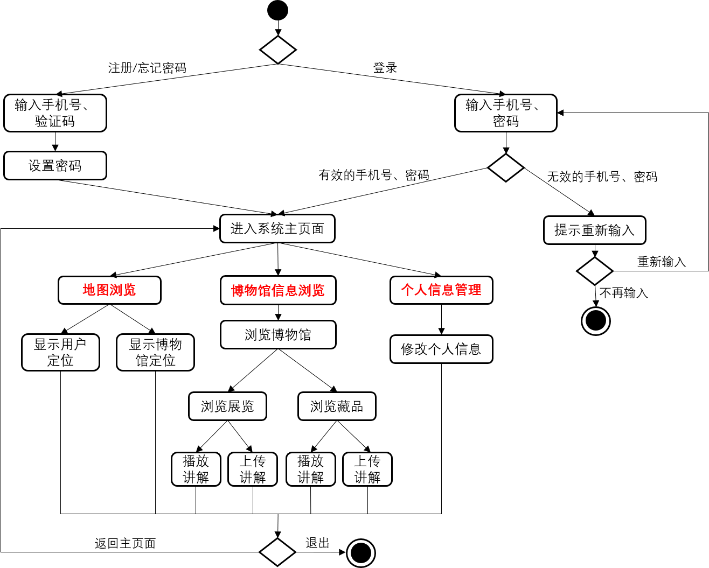
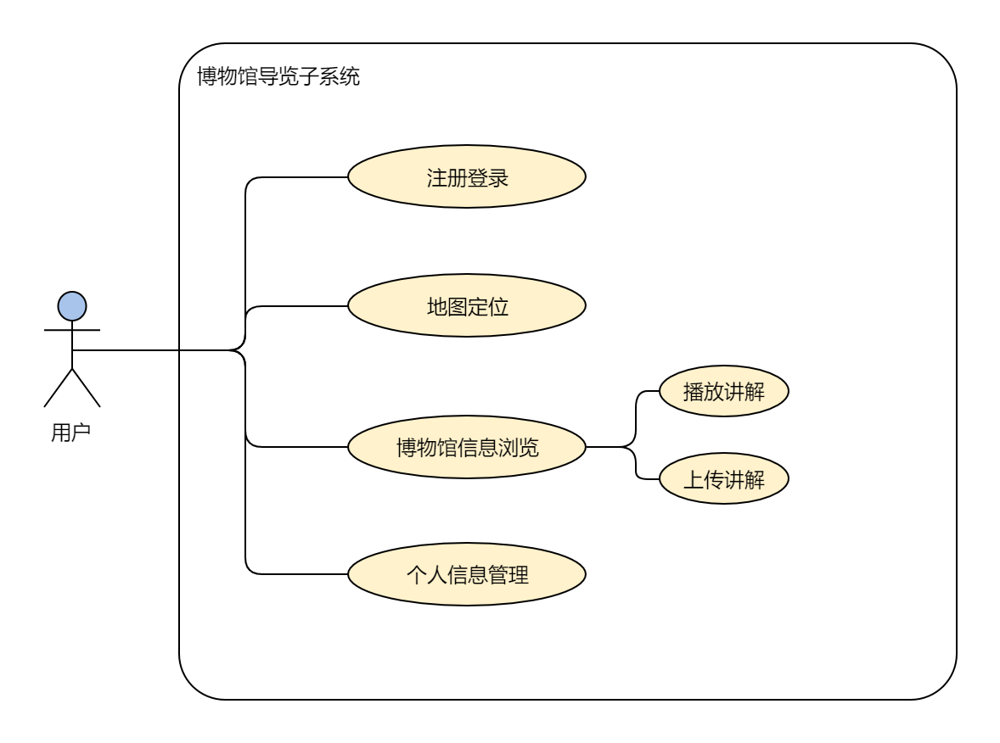
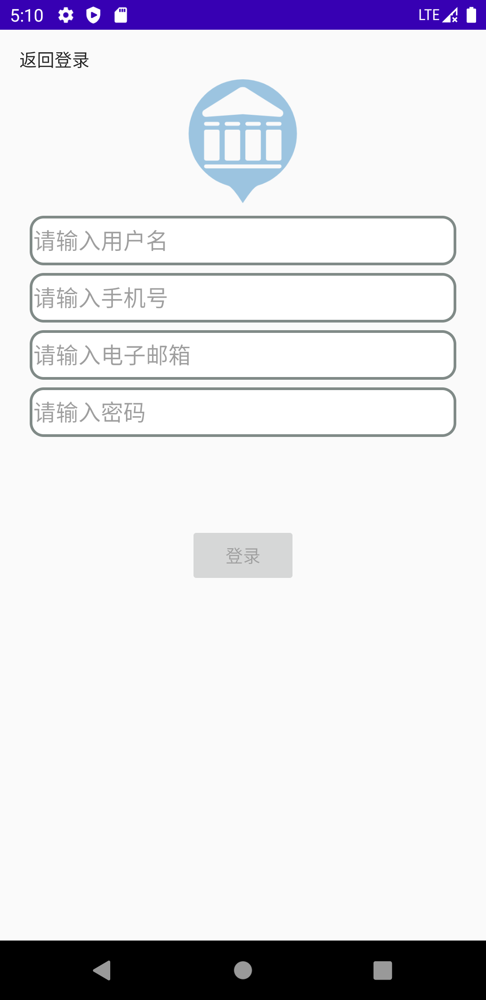
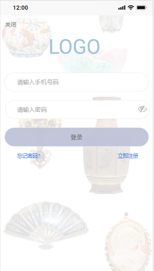
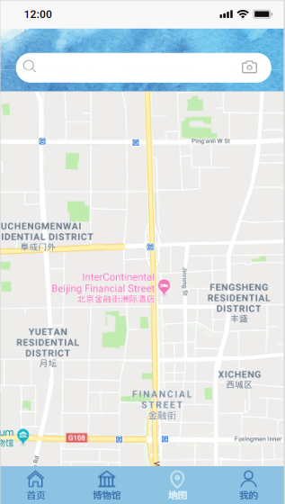
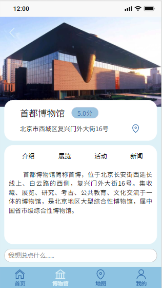
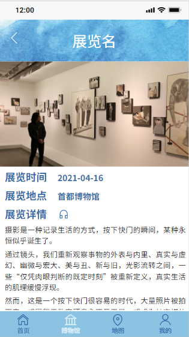
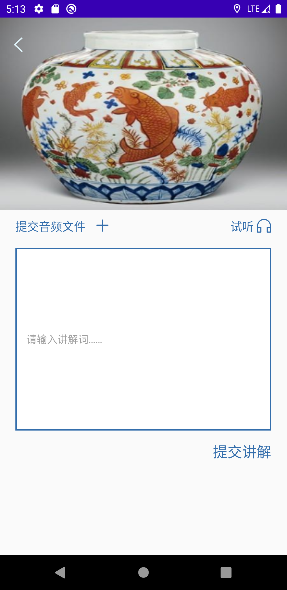
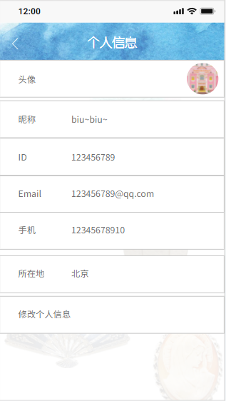

# 软件需求规格说明 ver1.2

## Revision

|   Date    | Version |       Description        | Author |
| :-------: | :-----: | :----------------------: | :----: |
| 2021.4.25 |   0.9   | 完成需求规格说明部分初稿 | 于珊珊 |
| 2021.4.27 |   1.0   | 完成需求规格说明完整初稿 | 于珊珊 |
| 2021.4.30 |   1.1   |     增加设计用户界面     | 于珊珊 |
| 2021.5.9  |   1.2   |     增加部分需求细节     | 于珊珊 |

## 1 简介

### 1.1 目的

本文档描述了博物馆导览子系统的功能需求和非功能需求，其阅读对象是项目的设计、开发、管理和测试人员以及项目用户。

### 1.2 范围

该文档用于导出目标系统的逻辑模型，解决整个项目系统关于“做什么”的问题，主要通过建立模型的方式来描述用户的需求。

博物馆导览子系统是一款手机应用程序，支持博物馆的讲解导览。通过利用第一小组（博物馆网站数据采集子系统）从博物馆网站爬取的信息，实现用户地图定位、浏览信息、播放讲解、上传讲解和个人信息管理的功能。

### 1.3 术语和缩写说明

| 术语和缩写 |                  说明                   |
| :--------: | :-------------------------------------: |
|    IEEE    |          电气与电子工程师协会           |
|    UML     | 统一建模语言(Unified Modeling Language) |

### 1.4 参考资料

《软件工程 实践者的研究方法》 Roger S.Pressman , Bruce R.Maxim ，机械工业出版社

### 1.5 内容组织

“2.系统描述”中分析了项目的背景和目标，以活动图方式给出了应用系统的功能及相互关系，并指出了软件的一般性限制；“3.详细需求”中给出了基于用例图和用例描述的详细需求分析，还定义了产品的性能需求，包括可靠性需求、安全需求等；“4.设计用户页面”给出了系统的UI设计原型图，进一步明确需求，同时方便开发人员编码实现。

## 2 系统描述

### 2.1 项目背景

当我们想要了解某些博物馆的展览、藏品信息时，我们需要逐个进入相应博物馆的官网浏览。为了避免这种麻烦，提升参观博物馆人群的体验，我们开发该博物馆导览系统，用户通过使用一个手机应用程序即可浏览国内一百多家博物馆的详情信息。

用户可以通过注册登录到系统当中，并设置密码等个人信息。该系统内包含了各个博物馆的基本信息、展览信息和藏品信息等，用户既可以播放一个博物馆、展览、藏品的相关讲解，也可以录制并上传自制的讲解，经平台审核通过后，其他用户便可以在手机应用中播放该讲解。除此之外，当用户浏览某个博物馆时，还可以跳转到地图页面查看博物馆的具体地理位置以及用户当前位置。

### 2.2 项目目标

1. 系统能够提供友好的用户界面，方便用户使用

2. 系统应当具有良好的运行效率，提升用户体验

3. 系统应有可扩充性，便于后期与第三小组（博物馆信息服务子系统）的整合

4. 通过这个项目的完成，锻炼同学们的系统开发和团队协作能力

### 2.3 整体结构

使用本系统的用户的整体活动图如下：

### 2.4 一般性限制

#### 2.4.1 系统运行网络环境

用户设备通过Internet连接Web服务器和数据库服务器，用户通过网络登录到本系统当中，浏览地图和博物馆信息以及实现用户个人信息的管理。

#### 2.4.2 系统运行硬件环境

Web服务器：

- CPU：i5-8400 2.8GHz
- 内存：16G
- 硬盘：1T
- 网卡：千兆

数据库/文件服务器：

- cpu：1核 2.0GHz
- 内存：1G
- 硬盘：50G

#### 2.4.3 系统运行软件环境

- 操作系统：CentOS 7/Windows 10
- 数据库：Mysql 8.0
- 开发工具包：JDK version 1.8
- 开发环境：IntelliJ IDEA 2021.1.1 x64
- Web服务器：Tomcat 10
- App环境：安卓8以上

#### 2.4.4 设计和实现约束

1. 系统的开发文档将遵循 IEEE 开发标准

2. 软件开发语言为 Java

3. 采用面向对象的分析设计方法，利用 UML 进行系统建模

## 3 详细需求

### 3.1 功能需求

用户的UML用例图：

系统优先级说明：

| 优先级 | 优先级名称 | 优先级描述                                                   |
| :----: | :--------: | :----------------------------------------------------------- |
|   1    |   基本的   | 1.0版本必须实现的功能                                        |
|   2    |   希望的   | 1.0版本争取实现的功能，可以留至2.0版本实现                   |
|   3    |   可选的   | 1.0版本咱不实现的功能，但要留下相应的实现接口以便后续版本实现 |

#### 3.1.1 注册登录

**用例描述：**注册登录

**执行者：**用户

**优先级：**1

**情景目标：**进入应用系统

**前提条件：**用户使用安卓手机并已下载该软件；

**基本路径：**	

1. 用户填写手机号码
2. 用户获取短信验证码
3. 选择注册
4. 用户设置登录密码
5. 进入应用

#### 3.1.2 地图定位

**用例描述：**地图定位

**执行者：**用户

**优先级：**2

**情景目标：**在地图页面获取博物馆的位置信息

**前提条件：**用户已登录系统

**基本路径：**	

1. 用户登录软件系统

2. 用户选择进入具体某个博物馆的详情页面

3. 用户点击“定位”图标

4. 系统跳转至地图页面中当前博物馆的地理位置处

#### 3.1.3 博物馆信息浏览

**用例描述：**博物馆信息浏览

**执行者：**用户

**优先级：**1

**情景目标：**浏览博物馆信息、展览信息和藏品信息

**前提条件：**用户已登录系统

**基本路径：**	

1. 用户登录软件系统

2. 用户选择具体某个博物馆并进入详情页面

3. 用户可以通过点击“展览/藏品”浏览博物馆的展览或藏品信息

4. 在展览/藏品详情页面用户可通过点击“讲解”图标选择播放讲解

#### 3.1.4 上传讲解

**用例描述：**上传讲解

**执行者：**用户

**优先级：**2

**情景目标：**上传关于博物馆展览或藏品的用户自制讲解

**前提条件：**用户已登录系统

**基本路径：**	

1. 用户登录软件系统

2. 用户选择具体某个博物馆并进入详情页面

3. 用户点击“展览/藏品”进入博物馆展览或藏品的页面

4. 用户点击“讲解”图标进入播放讲解的页面

5. 用户点击“上传讲解”进行自制讲解的上传

6. 平台审核用户上传的讲解

7. 审核通过则讲解上传成功

#### 3.1.5 个人信息管理

**用例描述：**个人信息管理

**执行者：**用户

**优先级：**1

**情景目标：**管理用户个人信息

**前提条件：**用户已登录系统

**基本路径：**	

1. 用户登录软件系统

2. 用户进入个人信息页面

3. 用户点击“修改个人信息”

4. 用户进行头像、昵称、邮箱等信息的修改

5. 用户点击“保存”，个人信息修改成功

### 3.2 性能需求

根据用户对本系统的要求，确定系统在响应时间、可靠性、安全性等方面的性能要求。

#### 3.2.1 页面需求

1. 页面内容：主题突出，行文格式统一、规范、明确，传递的信息准确、及时，内容丰富。

2. 导航结构：页面具有明确的导航指示，方便用户使用。

3. 技术环境：能用各种常用手机型号以不同分辨率浏览；无错误链接和空链接。

4. 艺术风格：界面清新悦目，布局合理，字号大小适宜、字体选择合理，色彩和谐自然，与主题内容相协调。

#### 3.2.2 响应时间需求

当用户登录，进行任何操作的时候，系统应该及时的进行响应，响应时间在10秒以内。系统应能监测出各种非正常情况，如与设备的通信中断，无法连接数据库服务器等，避免出现长时间等待甚至无响应。

#### 3.2.3 可靠性需求

系统应保证7X24内不宕机，在使用过程中，不会发生内存泄露、进程死锁的现象。

#### 3.2.4 安全性需求

本系统不影响其他软件的正常运行。

#### 3.2.5 可扩展性需求

系统设计要求能够体现扩展性要求，以适应将来功能扩展的需求。

## 4 设计用户界面

博物馆导览子系统的主要原型图如下：

- **注册页面：**

- **登陆页面：**

- **地图页面：**

- **博物馆信息浏览页面：**

- **上传讲解页面：**

- **管理个人信息页面：**

