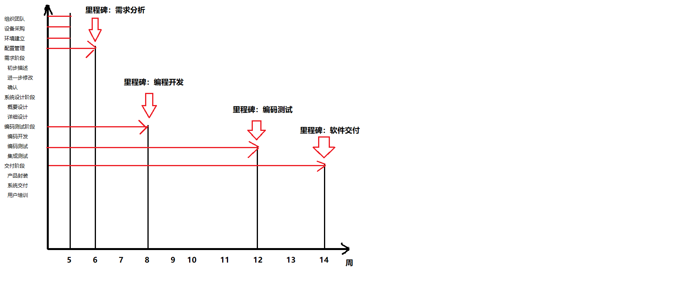

# 软件项目管理计划 ver1.1

## Revision

|Date|Version|Description|Author|
|:--:|:--:|:--:|:--:|
|2021.6.11|1.0|项目计划初稿|韩明宸|
|2021.6.12|1.1|更新人员分配和部分细节|韩明宸|

## 1 简介

### 1.1 项目概述

项目的目标是开发一款博物馆信息手机app，并提供后台管理系统，同时组员们获得系统的软件工程项目训练。本小组（第四小组）负责博物馆导览子系统的设计和实现。项目最终发布的产品是一款安卓端app应用、源代码、技术文档、和用户手册等。主要工作是需求分析、系统设计、开发测试，关键里程碑分别为需求规格说明初稿、设计报告初稿、子系统运行检查、总结汇报演讲、集成后运行检查和系统的交付。项目所需资源为Github和个人开发工具，进度大约为七周。

### 1.2 项目交付产品

项目交付日期为第七周周末（对应教学周为第十四周周末），交付地点为Github服务器(地址为https://github.com/1806-1/Software-engineering/)

主要交付物有：

系统源代码、用户使用手册、技术文档包（包括需求规格说明书、系统设计说明书、系统测试说明书、项目总结文档等）、项目进度日志

### 1.3 软件项目管理计划的演化

软件项目管理计划由组长上传至配置文档库，由组长负责维护。

形成初稿之后，根据项目的进展可以对其进行修改，需要有组员提出修改意见，在全体会议上讨论通过，并由组长将修改稿上传至文档库。其余组员通过版本同步获得更新稿。

### 1.4 参考资料

课程教材 《软件工程 实践者的研究方法》 Roger S.Pressman , Bruce R.Maxim ，机械工业出版社 

## 2 项目组织

### 2.1 过程模型

软件开发计划：（以下时间为教学周）

|关键时间|任务|要求|
|:--:|:--:|:--:|
|第五周|确定团长、组长和分组|分组名单提交给教辅老师，团长汇总提交；在github/DevCloud上建立项目库，开始发布周记|
|第六周|制定项目管理计划|管理计划、周记发布到github/DevCloud上|
|第八周|完成需求规格说明初稿|需求规格说明书、本周代码更新、周记发布到github/DevCloud上|
|第九周|完成设计报告初稿|设计报告、本周代码更新、周记发布到github/DevCloud上|
|第十二周|子系统运行检查|以小组为单位进行，小组全部成员参加。与教辅老师提前预约时间。|
|第十三周|总结汇报演讲|以团队为单位，按照抽签顺序进行。|
|第十四周|系统集成后的运行检查|以团队为单位进行，组长和主要程序开发人员参加。团长提前跟教辅老师预约时间。此时向教辅老师提交各种文档的电子版；提交电子版源代码和可执行系统。|

### 2.2 组织结构

现代程序员组：

技术组长：韩明宸

行政组长：于珊珊

程序员：张世旭、黄泽慧、殷雄雄

### 2.3 组织接口

|组织|联系人|
|:--:|:--:|
|安卓端|张世旭|
|后端|韩明宸|

### 2.4 项目职责

|角色|职责描述|负责人员|
|:--:|:--:|:--:|
|项目经理|领导项目团队，执行和管理项目，负责项目的交付工作|韩明宸|
|需求分析员|整理需求分析并以撰写需求分析文档 |于珊珊|
|UI设计员|设计APP的UI并提交规格|黄泽慧|
|开发人员|软件设计和编写代码|张世旭|
|测试人员|软件代码测试和用户测试|于珊珊|

## 3 管理过程

### 3.1 管理目标和优先级

+ 基本管理原则：
每位成员既是积极的建言者，又是负责的合作者。
决策应在充分的讨论基础上做出，并被及时有效的执行。

+ 目标1：
按时按量完成项目的基本功能，按时发布产品
优先级：1（最高）

+ 目标 2：
遵循规范化的项目运作标准，文档严谨完整，代码注释充分，便于后续维护
优先级：2

+ 目标 3：
产品运行稳定，界面友好易上手
优先级：3

+ 目标 4：
注重团队建设，成员分工合理，合作默契，气氛融洽
优先级：4

### 3.2 假设、依赖关系和限制

假设 1：项目相关的硬件设施（包括版本控制服务器、开发人员个人电脑）稳定工作

限制：若硬件设施出现异常，可能造成部分工作甚至整个开发进程陷于停顿

### 3.3 风险管理

项目风险：
|标题|发生可能|影响|优先级|规避或减轻策略|负责人|预定完成日期|
|:--:|:--:|:--:|:--:|:--:|:--:|:--:|
|开发技术不熟练|80%|灾难的|高|提前制定好学习计划；降低设计难度|于珊珊|第八周前|
|需求频繁变更|50%|严重的|中|需求指定充分预见未来|韩明宸|第八周前|
|缺少美工人才|80%|轻微的|中|网上寻找素材|黄泽慧|第八周前|

风险的详细描述如下：

+ 风险1：开发技术不熟练
没有组员学习过安卓前端开发知识，但是部分组员没有接触过Java相关知识。可能导致卡法进度受阻，代码交流困难

+ 风险2：需求频繁变更
在设计开发过程中可能发现原有需求不容易转化为设计稿，会带来需求的重新变更。这种情况要尽量避免，以免带来重复开发的浪费。

+ 风险3：缺少美工人才
手机appUI设计需要较多优秀的图标，项目组里没有人擅长设计图标，需要在网上寻找素材并进行UI设计

### 3.4 监督和控制机制

+ 报告机制
每周例会上组长负责收集小组成员的工作情况并上传至文档库。

+ 报告格式，应包括：
报告时间，工作内容，下周计划

+ 评价和审核机制：
每周例会上小组讨论形成一致意见后即为通过，相关负责人针对改进意见开展下一周工作，小组会议持续评估其成效。
每一项目阶段结束之前（里程碑前后），组织一次阶段评审会，评估整个阶段的工作效率和成果质量。尽量与项目例会合并。

### 3.5 人员计划

|人员名称|人数|人员要求|来源|
|:--:|:--:|:--:|:--:|
|后端程序员|2|熟悉Java Servlet开发|韩明宸、殷雄雄|
|安卓程序员|3|熟悉安卓端开发|张世旭、黄泽慧、于珊珊|
|UI设计|1|熟悉使用相关工具|黄泽慧|
|测试人员|5|熟悉开发工具，有耐心|全体组员|
|文档人员|2|编辑项目相关文档，并跟进更新|韩明宸、于珊珊|

## 4 技术过程

### 4.1 方法、工具和技术

本小组的团队组织结构为现代程序员式组织结构；编程语言为Java；采用面向对象的分析设计方法；同意文件命名、代码版式、注释等编码规范；编码人员进行代码走查后再进行代码编译；测试人员根据测试文档进行单元测试；最后实现软件的交付。

开发环境为 IntelliJ IDEA 2021.1.1 ，Java JDK版本为1.8 

### 4.2 软件文档

项目文档列举如下：

1. 软件项目管理计划文档：
该文档由组长完成，介绍项目的整个管理过程。
该文档再需求分析阶段开始完成，在后续每个阶段更新。

2. 需求规格文档
在需求分析阶段，小组成员共同分析收集用户需求，由组长负责编写规格说明文档，在后续的设计和开发阶段不断更新。
该文档主要内容为：功能需求，性能要求，数据处理要求，软件运行需求等。

3. 软件设计文档
在总体设计阶段，小组根据需求规格说明文档，完成软件体系结构的设计，编写体系结构设计文档，并在后续开发阶段补充和更新。
该文档由开发人员负责编写。

4. 软件测试文档
在软件开发阶段，测试人员需要编写测试规格说明文档，并在后续测试阶段更新。
开发人员将根据测试规格说明文档建立测试环境。

### 4.3 用户文档

在需求分析阶段，组长需要开始着手编写用户手册，并在需求分析结束后需要形成初稿；在后续阶段不断更新用户文档；并在系统交付阶段随着系统一起被交付。

### 4.4 项目支持功能

在开发阶段结束后，开发人员之间会进行代码走查，减少 bug，并在测试阶段跟新源代码。测试人员根据测试文档进行软件测试，提高软件的正确性。

## 5 进度表

